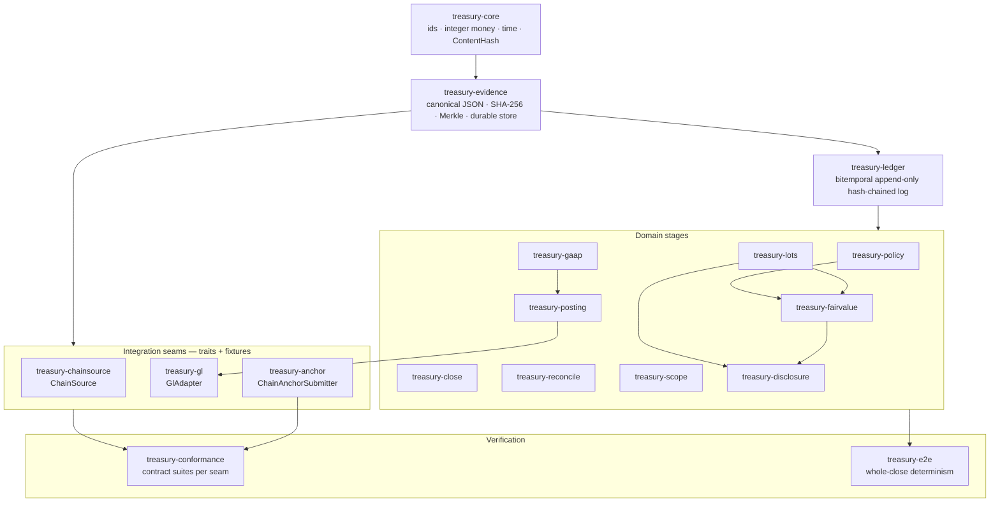

# Architecture — presidio-hardened-treasury

This document is the single entry point to how the system is built and why. The
authoritative *what* is the [active spec](docs/treasury-suite-spec-v2.md); the
*why* behind hard-to-reverse choices is the [ADR series](docs/adr/); delivery
status per requirement is [`PRESIDIO-REQ.md`](PRESIDIO-REQ.md). This file ties
those together into the shape of the codebase.

## Design thesis

The deliverable is not a dashboard. It is a defensible quarterly close an
external auditor will sign, where every reported number reproduces byte-for-byte
from hashed inputs with no trusted intermediary — including us. That single
requirement drives every structural decision below, and the recurring move is to
make the dangerous state *unrepresentable* rather than to validate against it
after the fact: unbalanced journal entries cannot be constructed, a judgment
without an approver cannot enter the ledger, a float cannot be hashed, an indexer
that disagrees with its independent twin cannot close the period.

The operator is inside the threat model. Controls that would only work if we are
honest are treated as residual risk, not mitigations — which is why tamper
evidence ultimately rests on commitments published *outside* our trust boundary
(see [external anchoring](#external-anchoring-the-trust-exit)).

## The claim-layer model

Every fact in the system belongs to one of four layers, and the layer determines
what provenance it must carry to be admissible. This is the spine of the whole
design.

**L1 observations** are raw external facts — a chain address history, a venue
balance — each carrying the evidence-store hash of the bytes it came from. **L2
derived facts** are deterministic functions of L1 (an auto-netted internal
transfer), keyed by the content hash of the code/config that produced them, so
they are reproducible. **L3 judgments** are human decisions (a scope assessment,
a non-purchase-acquisition designation, a match confirmation); they structurally
require a preparer, a *distinct* approver, and a content-addressed policy hash —
dual control is a type, not a convention. **L4 policy outputs** are pure
functions of L1–L3 under a content-addressed policy (the journal entries, the
valuation report); given the same inputs and policy hash they are byte-identical.

A number in the disclosure pack is therefore an L4 output whose entire
dependency closure — every L1 observation, L2 derivation, L3 judgment, and policy
artifact it rests on — is reachable and hash-verifiable. Auditing it is
fetch-recompute-compare.

## Evidence, content-addressing, and the ledger

Two foundations sit under everything. **`treasury-evidence`** is the
content-addressed store: canonical JSON that *rejects floats and depth-bombs at
the boundary* (a value that cannot hash identically on every toolchain is not
evidence), SHA-256 addressing, and RFC 6962 Merkle tree heads for anchoring. Its
durable file backend re-verifies every blob against its recorded hash on open.

**`treasury-ledger`** is the bitemporal, append-only, per-tenant hash-chained
event log. It records both event time and knowledge time, so "what did the books
say as of the 10-Q filing" is a query (`as_of`), not an archaeology project.
Corrections *supersede*; they never mutate, and supersession cannot race, cross
tenants, or cross claim layers. `verify_chain` recomputes every link and detects
any post-hoc mutation, insertion, or deletion. Its durable backend is
replay-verified on open: every record re-runs full validation and must reproduce
its recorded event id, or the log refuses to load.

All money is integer base units (`AssetAmount`, atoms as decimal strings) with
checked arithmetic; floating point is denied workspace-wide in the accounting
path and rejected at canonicalization. There is no float anywhere a number can
become evidence.

## The close pipeline

The seven-stage close (spec §2) maps onto the domain crates as follows. Each row
is a pure-domain stage; the two stages that touch the outside world (ingestion,
GL output) terminate at a *trait seam* rather than a concrete integration — see
[the seam model](#the-io-seam-model).

| Stage | Crate(s) | What it guarantees |
|-------|----------|--------------------|
| Ingestion (chain) | `treasury-chainsource` | Chain-agnostic, integer-only `AddressHistory`, content-addressed; finality-gated two-source reconciliation (divergence blocks close); reproducibility gate; agreed history → L1 observation |
| Ingestion boundary | `treasury-ingest` | Read-only by construction: content-addressed egress allowlist (deny by default), fail-closed venue key-scope validation |
| Reconciliation | `treasury-reconcile` | Tiered internal-transfer matcher (discrete corroboration classes, no float confidence); materiality-gated auto-netting (L2); dual-control confirmation and non-purchase-acquisition designation (L3); unclassified legs block close |
| Scope | `treasury-scope` | ASU 2023-08 six-criteria gate under dual control; out-of-scope assets hard-block before valuation |
| Lots & basis | `treasury-lots` | Integer-only lots, fees decomposed from basis, relief order as a recorded policy election, basis-preserving transfers |
| Fair value | `treasury-fairvalue` | Integer-exact valuation as a pure function of `(lots, price-snapshot, policy)`; fail-closed on missing prices |
| GAAP entries (L4) | `treasury-gaap` | Structurally balanced journal entries with typed statement-line routing; unbalanced entries are unconstructible |
| GL output | `treasury-posting` + `treasury-gl` | Posting protocol (content-addressed idempotency keys, dual-control release, read-back verification) driven against a vendor-agnostic adapter where read-back is mandatory *by type* |
| Checkpoint lineage | `treasury-close` | Closed periods as immutable DAG nodes; supersession requires a reason code + materiality memo; as-filed vs as-corrected are pointers |
| Disclosure | `treasury-disclosure` | Roll-forwards that structurally cannot fail to roll, two-way valuation tie-out, content-addressed pack with an evidence-reproduction manifest |
| Policy substrate | `treasury-policy` | Content-addressed, approval-signed policy artifacts; per-tenant activation timelines; the `(lots, price-snapshot-hash, policy-hash)` valuation key |
| External anchoring | `treasury-anchor` | Coverage-monotonic receipts; Merkle aggregation + Bitcoin submission-lifecycle pipeline with depth gating and overdue-liveness |

## Dependency layering

The crates form a strict acyclic stack: a pure foundation, the evidence and
ledger substrate, the domain stages, the integration seams, and the verification
layer that depends on everything in order to test it.

## The I/O seam model

The two stages that cross a trust boundary — pulling chain data in, pushing
journal entries out — and the wallet that publishes anchors are the only places
the system meets the outside world. ADR-0001 through ADR-0004 resolve these as
**traits the pure domain plugs into**, with the concrete integration (a real
node+indexer, a NetSuite/SAP/QuickBooks instance, a Bitcoin wallet) as an
out-of-core I/O shim. Three seams exist:

`ChainSource` (`treasury-chainsource`, ADR-0004) — a node+indexer yielding a
normalized `AddressHistory`. Bitcoin runs Core + electrs/Fulcrum and Ethereum
runs reth + Erigon, with the independence axis placed where silent bugs live (the
indexer for BTC, the whole execution client for ETH). `GlAdapter`
(`treasury-gl`, ADR-0003) — a general ledger where read-back is a mandatory trait
method, so a post-only adapter that cannot verify what it posted cannot exist.
`ChainAnchorSubmitter` (`treasury-anchor`, ADR-0002) — the chain wallet that
broadcasts the aggregation root and reports confirmations into the anchoring
state machine, which is the tested core.

Each seam has an in-memory fixture (deterministic, used by the rest of the test
suite) and a **written contract** in `treasury-conformance`: one parameterized
`verify_*_contract` per seam asserting the invariants the pure core assumes — a
non-deterministic indexer, a wallet reporting an unprovable confirmation, a GL
that double-posts a retried key all fail the suite. The same assertions run
against the fixtures today and against a real endpoint the day it is wired, so no
shim enters the evidence path without first passing its contract. This is the
boundary between "complete and verified" (everything above the seams) and the
remaining live-I/O work (everything below them).

## External anchoring: the trust exit

Because the operator is in the threat model, internal hash chaining is not enough
— an insider who can rewrite history can also recompute the chain. So
`treasury-evidence`'s RFC 6962 tree head is periodically committed to a venue
outside our control (a Bitcoin transaction per ADR-0002). The anchoring pipeline
Merkle-aggregates many heads into one transaction (per-head inclusion proofs
preserve individual verifiability), gates "anchored" on a confirmation-depth
threshold, and flags any submitted-but-unconfirmed anchor as overdue so it cannot
become a silent coverage gap. The anchor log is coverage-monotonic: a receipt
covering fewer entries than its predecessor is structurally rejected. An auditor
verifies tamper-evidence against the chain, not against us.

## Determinism and cross-verification

Two independent checks guard the central "reproduces byte-for-byte" claim. Every
hash envelope in the system carries a **golden vector** — its expected hash,
recomputed by an independent Python implementation — so a drift in canonical-JSON
or hashing rules fails a test rather than silently changing identities.
And `treasury-e2e` runs the **whole close twice** and asserts the disclosure-pack
hash is identical, proving end-to-end determinism across every stage.

## Implemented vs. Phase 1 I/O

Everything in the claim-layer model, the close pipeline, anchoring, and the seam
*contracts* is implemented and verified against deterministic fixtures. What
remains is live I/O behind the three seams: the concrete electrs/Fulcrum/reth/
Erigon shims and the read-only egress proxy, the NetSuite → QuickBooks → SAP GL
adapters, the Bitcoin anchor wallet, and the enclave-based xpub derivation
(REQ-11, vendor open). Each lands against a design partner's stack and is held to
its conformance contract before it is trusted. The presentation layer (the
auditor-facing reproduction UX) is likewise Phase 1.

## Further reading

- [`docs/treasury-suite-spec-v2.md`](docs/treasury-suite-spec-v2.md) — the active spec (source of truth).
- [`docs/adr/`](docs/adr/) — the accepted decisions (chain indexing, anchor target, GL priority, node/indexer selection).
- [`PRESIDIO-REQ.md`](PRESIDIO-REQ.md) — requirements with delivery status per phase.
- [`docs/threat-model.md`](docs/threat-model.md) — STRIDE per trust boundary, operator in scope.
- [`SECURITY.md`](SECURITY.md) — the hardening baseline.
- [`docs/auditor-evidence-guide.md`](docs/auditor-evidence-guide.md) — how an auditor reconstructs a close from a pack hash.
